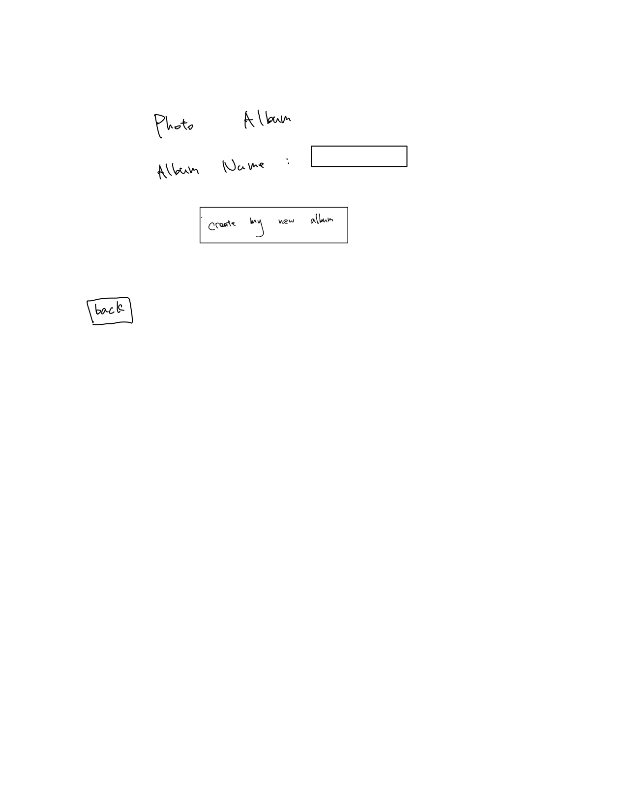
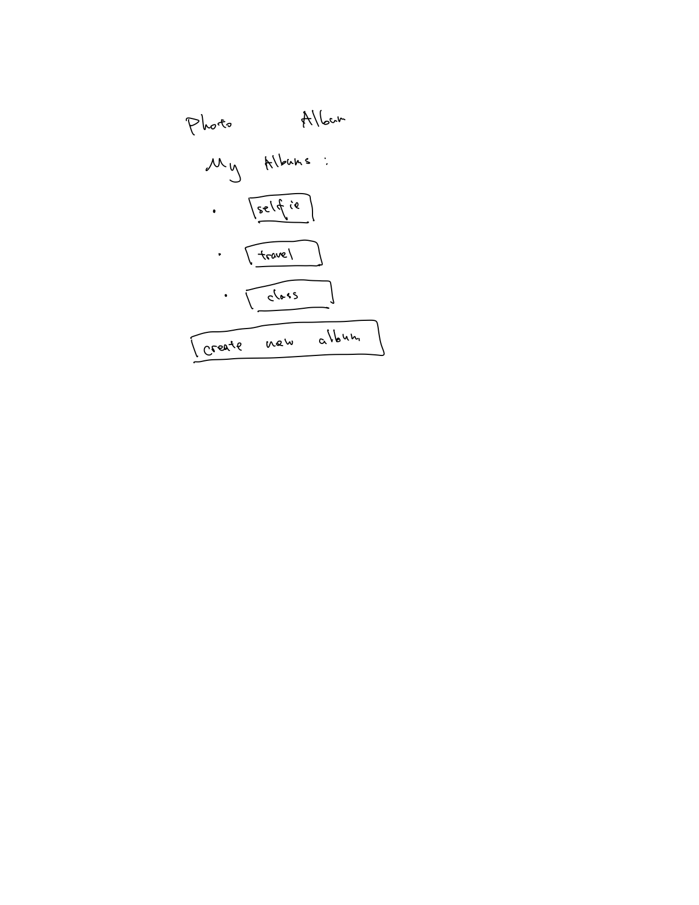
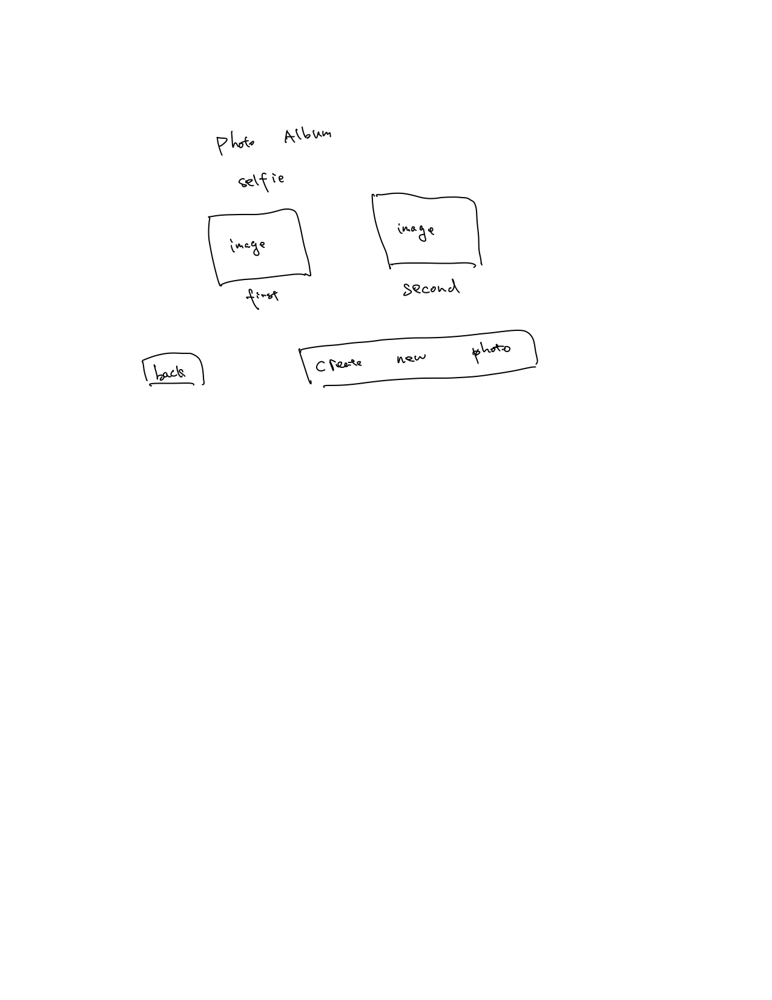
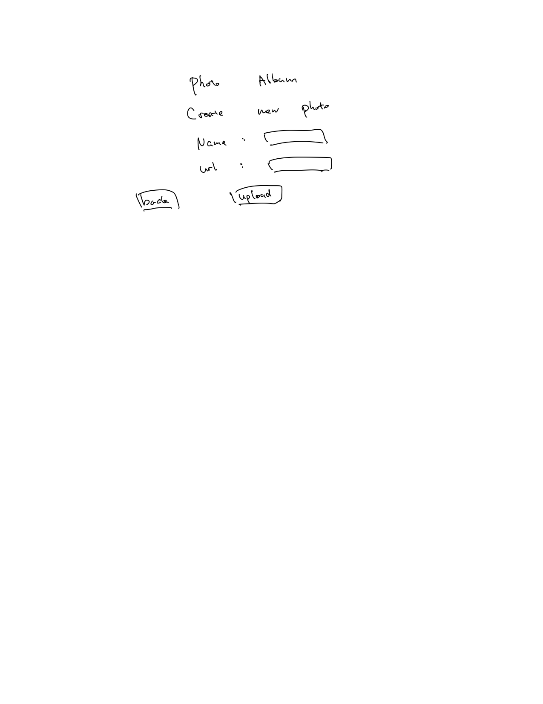
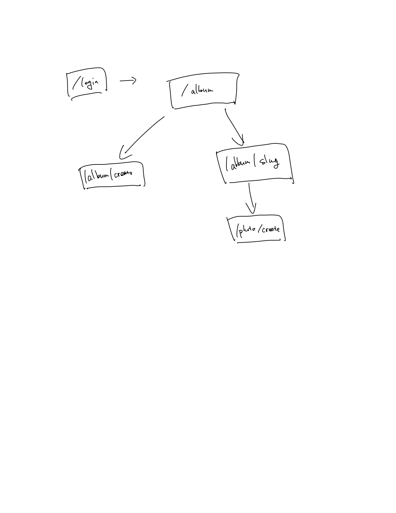

# Photo Album 

## Overview


I intend to build a simple web application that mimics the functionality of a photo
album in our daily life. In this app, users are allowed to register and login. And after 
loging in, users can view, add, delete their photo collections. In addition, a single user
can keep track of multiple photo albums.


## Data Model

The application will store Users, Albums and Photos(url)

* users can have multiple albums (via references)
* each album can have multiple photos' urls (via references)
* each album can have only one user (via reference)


An Example User:

```javascript
{
  username: "photokeeper",
  hash:  "the hash", // a password hash
  album: [ObjectId(1234)]// an array of references to album documents
};
```

An Example Album:

```javascript
{
  user: ObjectId(4321), // a reference to a User object
  name: "my first album",
  photos: [ObjectId(4567)], // an array of references to photo documents
  slug: "my-first-album"
};
```

An Example Photo

```javascript
{
  name: "my first photo",
  url: "www.foo.jpg"
};
```


## [Link to Commented First Draft Schema](db.js) 


## Wireframes


/album/create - page for creating a new photo album



/album - page for showing all photo albums



/album/slug - page for showing all photos in a specific photo album



/photo/create - page for creating a new photo item in an album



## Site map



## User Stories or Use Cases

1. as non-registered user, I can register a new account with the site
2. as a user, I can log in to the site
3. as a user, I can create a new photo album
4. as a user, I can view all of the photos I've uploaded in a single album
5. as a user, I can add photos to an existing photo album
6. as a user, I can delete photos in an existing photo album
7. as a user, I can delete a whole photo album that I've created

## Research Topics

* (5 points) Integrate user authentication
    * I'm going to be using Passport for user authentication
* (3 points) Perform client side form validation using a custom JavaScript library
    * I'm going to write a custom library for form validation for this project
    * errors would be integrated into the DOM

8 points total out of 8 required points 


## [Link to Main Project File](app.js) 


## Annotations / References Used

1. [passport.js authentication docs](http://passportjs.org/docs) 

2. [mdn documents for client-side form validation](https://developer.mozilla.org/en-US/docs/Learn/Forms/Form_validation)

